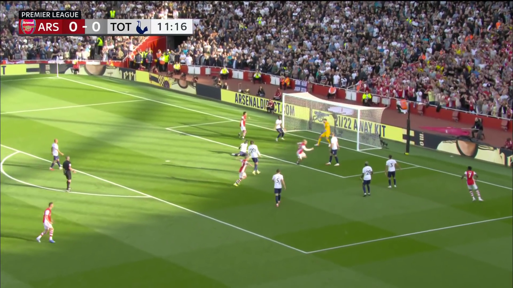
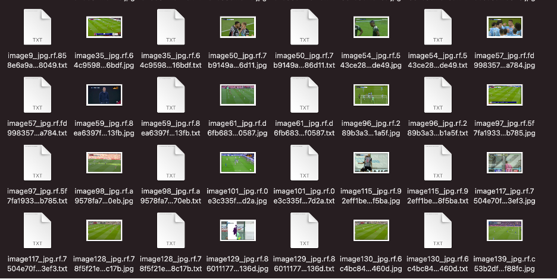
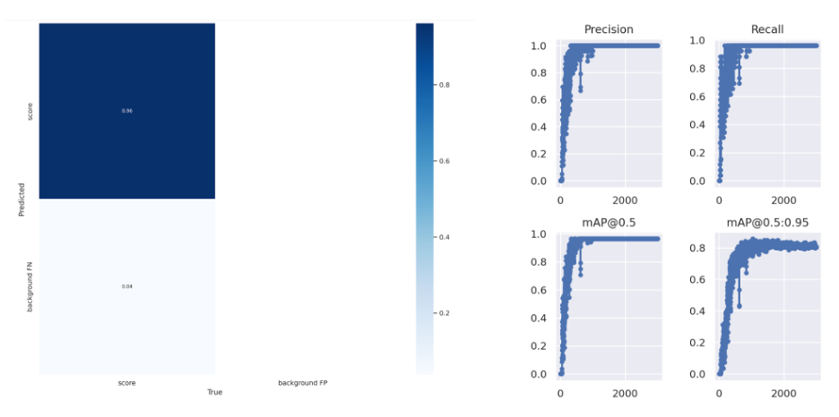
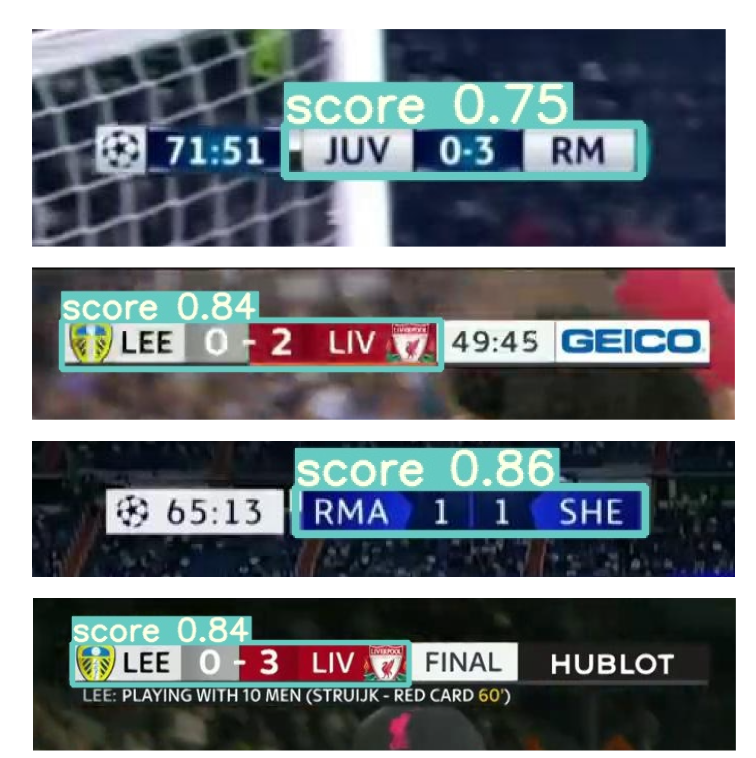
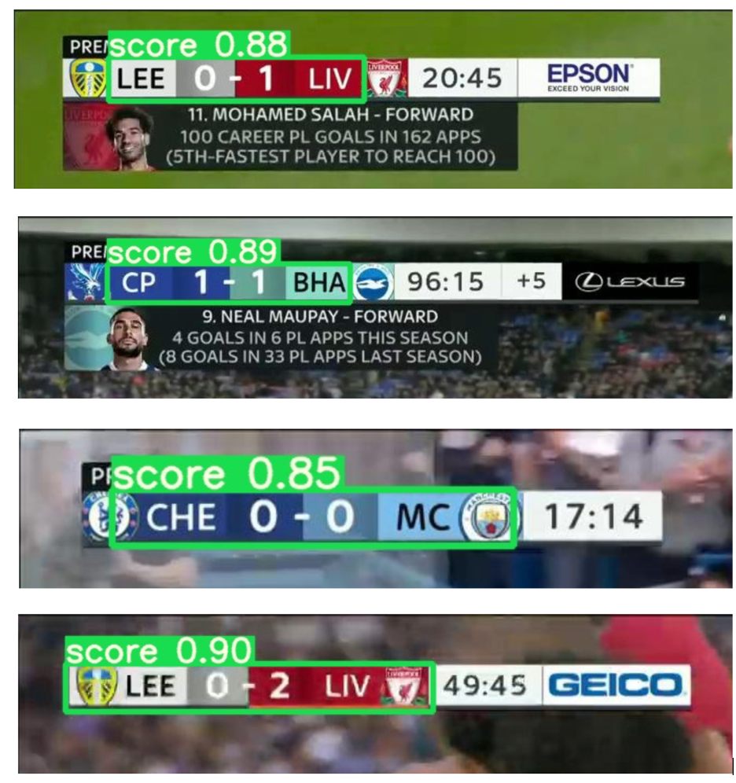
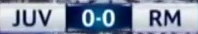

<div align="center">

 <a href="https://colab.research.google.com/drive/1mFFf66O9wgkbEnsKHzmgk8fyWimKocxT?usp=sharing"></a>
 <a href="https://colab.research.google.com/drive/1ug4vT5NuDasLcJMhZo9scnzI-Ds6ouLh?usp=sharing"></a>

</div>

# Score board detection

## Step1: Download the videos

We used [Firefox](https://addons.mozilla.org/en-US/firefox/addon/savefromnet-helper/) to download the videos from [NBC Sports](https://www.youtube.com/c/NBCSports/videos) youtube channel. For this iteration we only downloaded the soccer matches.

## Step2: Extract the frames from the videos

For this step we used a python script 'frameExt.py' which uses OpenCV library to extract the frames from the video.

### Prerequisition for python scripts

```bash
pip install -r requirements.txt
```

### list of python scripts

* frameExt.py

#### Description:

This script will create a folder, read the mp4 file and it will capture image in each 0.5 second and save frame as JPG file

#### How to run python scripts

##### ex: python frameExt.py 'Aston.mp4' './img2'

```python
python frameExt.py <mp4path> <outputfolderpath>
```

### One sample frame

<p align="center">

</p>

## Step2: Labeling the frames in yolov5 format

For this step we used [Roboflow Annotate](https://roboflow.com/annotate) tool and annotate our frames one by one. Yolo needs individual txt file for each image.

<p align="center">

</p>

## Step3: Training a model

The [Train Notebook](Notebooks/Train.ipynb) will walk you trough the steps on how to train your own yolov5 model using your own labeled dataset.  

For this project we choose YOLOv5. YOLO is one of the most famous object detection algorithms due to its speed and accuracy. Yolov5 has diffrent versions and we chose yolov5s which is small and fast. We trained one model with larger box for 1000 epochs and used its best weights and Used it for transfer learning to train smaller dataset. For the second training we trained the model for 3000 epochs. Since the shape of the score board is not complex we got a pretty good accuracy map0.95 : ~ 80%


<p align="center">

</p>

Our model successfully detects the scoreboards of diffrent shape and color.

<p align="center">

</p>


## Weights that we have
We have 4 saved weights 

* Best -> detect the score , names and logos
* Best2 -> detect the entire scoring board
* Best3 -> Not really good
* Best4 -> Tries to only detect the scores and names but only in some cases it can in others it will include a part or the entire logos.

<p align="center">

</p>


## Useing the yolov5 model for detection

The [Detect Notebook](Notebooks/Detect.ipynb) will walk you trough the steps on how to use the yolov5 for detecting the score board on your images or videos. 

## Step4: Using the yolos output to crop the box using openCV

First we need to convert the cordinates to xmin,xmax,ymin,ymax and then use openCV to crop the box out of each fame. 

<p align="center">

</p>

## Step4: reading the Characters 


## References
* [Firefox](https://addons.mozilla.org/en-US/firefox/addon/savefromnet-helper/)

* [NBC Sports](https://www.youtube.com/c/NBCSports/videos)

* [OpenCV](https://pypi.org/project/opencv-python/)

* [YOLOv5](https://github.com/ultralytics/yolov5)

* [Roboflow Annotate](https://roboflow.com/annotate)
